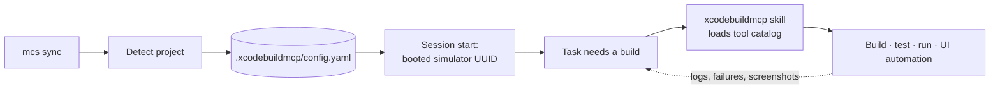

# iOS Development

A [tech pack](https://github.com/mcs-cli/mcs) that wires Xcode into Claude Code. Claude Code can already write Swift — what it can't do out of the box is build it, run it on a simulator, read the failure, and look up the API it got wrong. This pack closes that loop: every build, test, and simulator action goes through XcodeBuildMCP, Apple's documentation is one search away, and the booted simulator is announced at session start so Claude targets a device by UUID instead of guessing at names.

```
identifier: ios
requires:   mcs >= 2026.3.6
```

---

## Install

```bash
brew install mcs-cli/tap/mcs      # 1. install mcs
mcs pack add mcs-cli/ios          # 2. register this pack
cd ~/Developer/my-ios-project     # 3. sync from the project you want configured
mcs sync
mcs doctor                        # 4. verify everything is healthy
```

**Prerequisites:** macOS, [Claude Code](https://docs.anthropic.com/en/docs/claude-code), and Xcode with its command line tools (`xcode-select --install`). `mcs` installs the rest through Homebrew — the [XcodeBuildMCP](https://github.com/getsentry/xcodebuildmcp) binary, `jq` for the simulator hook, and Node for the skill installer.

Sync per project rather than globally: the pack asks which Xcode project or workspace to target and writes a `.xcodebuildmcp/config.yaml` beside it, so it has to run from inside the repo.

---

## How it works



1. **At sync** — the pack auto-detects your `.xcodeproj` or `.xcworkspace` and writes `.xcodebuildmcp/config.yaml` with the project path, `iOS` as the default platform, and the workflow set enabled. The file is gitignored for you.
2. **At session start** — a hook asks `simctl` for a booted simulator and reports its name and UUID as session context. Nothing is printed when no simulator is running.
3. **Before the first build** — `CLAUDE.local.md` tells Claude to invoke the `xcodebuildmcp` skill first, loading the tool catalog and workflow guidance instead of guessing at tool names, and to confirm the active project, scheme, and simulator with `session_show_defaults`.
4. **During work** — builds, tests, runs, simulator control, log capture, and UI automation all go through XcodeBuildMCP tools. Raw `xcrun` and `xcodebuild` calls are off-limits, warnings get fixed rather than suppressed, and nothing is built or tested unless you ask.
5. **When an API is unfamiliar** — Sosumi searches Apple's developer documentation over MCP, with no local index to build and nothing extra to install.

---

## Configuration

Syncing asks one question: which Xcode project or workspace to use. `mcs` detects every `*.xcodeproj` and `*.xcworkspace` in the repo and offers them; your answer becomes `sessionDefaults.projectPath` in the generated config and fills the project placeholder in the build rules written to `CLAUDE.local.md`.

The generated `.xcodebuildmcp/config.yaml` pins the default platform to `iOS`, leaves `suppressWarnings` off, turns on test timing output, and enables the simulator, UI automation, project discovery, utilities, session management, debugging, logging, doctor, and workflow discovery workflows.

To point the pack at a different project — or after renaming one — re-run `mcs sync`; the config is regenerated at sync time, not read from a setting at runtime.

---

## What's included

| Component | What it does |
|---|---|
| **XcodeBuildMCP** (MCP) | Build, test, run, simulator control, log capture, and UI automation, served by the Homebrew `xcodebuildmcp` binary |
| **Sosumi** (MCP) | Apple developer documentation search over HTTP |
| **xcodebuildmcp** (skill) | Loads the XcodeBuildMCP tool catalog and workflow guidance before the first build |
| **ios-simulator-status.sh** (hook) | Reports the booted simulator's name and UUID at session start |
| **configure-xcode.sh** (script) | Writes `.xcodebuildmcp/config.yaml` from the detected project at sync time |
| **ios.md** (template) | Simulator rules — booted device first and by UUID, ask when none is booted, run the formatter and linter after editing Swift |
| **xcodebuildmcp.md** (template) | Build rules — skill first, verify session defaults, never call `xcrun`/`xcodebuild` directly, never suppress warnings, prefer `snapshot_ui` over `screenshot` |
| `.xcodebuildmcp` (gitignore) | Keeps the generated config out of version control |

`mcs doctor` additionally checks that the Xcode command line tools are installed, and offers `xcode-select --install` as the fix.

---

## Directory structure

```
ios/
├── techpack.yaml                   # Manifest — defines all components
├── hooks/
│   └── ios-simulator-status.sh     # Booted simulator detection
├── templates/
│   ├── ios.md                      # Simulator and code quality rules
│   └── xcodebuildmcp.md            # Build/test rules for the detected project
└── scripts/
    └── configure-xcode.sh          # Writes .xcodebuildmcp/config.yaml
```

---

## You might also like

| Pack | Description |
|---|---|
| [dev](https://github.com/mcs-cli/dev) | Foundational settings, plugins, and git workflows |
| [memory](https://github.com/mcs-cli/memory) | Persistent memory and knowledge management across sessions |

---

## Links

- [MCS](https://github.com/mcs-cli/mcs) — the configuration engine
- [Creating Tech Packs](https://github.com/mcs-cli/mcs/blob/main/docs/creating-tech-packs.md)
- [Tech Pack Schema](https://github.com/mcs-cli/mcs/blob/main/docs/techpack-schema.md)

---

## License

MIT
